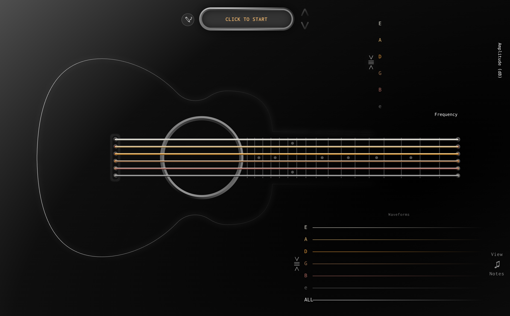

# Visualize How a Guitar Works



This is my final project for CS 4804 (Data Visualization) at WPI. This project is a web application that visualizes how a guitar works using D3.js, the Web Audio API, and HTML Canvas. 

Access it here: [https://weavergoldman.com/visualize-guitar/](https://weavergoldman.com/visualize-guitar/)

## Project Structure

AI usage details can be found in [AI_USAGE.md](AI_USAGE.md).

### Process Book and Project Video

The process book is available as a PDF here: [process_book.pdf](documents/process_book.pdf)

The project video is available here: https://www.youtube.com/watch?v=YPDqCRBkffA

### Code Structure

Code for the project can be found in the `src` and `preprocess` directories. The `src` directory contains the frontend code for the web application, while the `preprocess` directory contains code for preprocessing MIDI and GP5 files.

### Data

The dataset is "The Last of Us - Main Theme" by Gustavo Santaolalla, which can be found on MuseScore:

https://musescore.com/user/64313029/scores/10610818

It was downloaded as a MIDI file and then converted to a GP5 file with [TuxGuitar](https://www.tuxguitar.app/). The MIDI file was used for the audio playback and the GP5 file was used for the string and fret information.

Both files are stored in the `data` directory.

The output of the preprocessing code is stored in `public/data/the-last-of-us.json`, which is used by the frontend. 

The `public/data` directory also contains other JSON files that are used for the more educational phases of the website (playing just one string, chord progression, etc.). These were created manually based on the output of the preprocessing code.

## Running the Project Locally

To run the project locally, follow these steps:

1. Clone the repository:

   ```bash
   git clone https://github.com/We-Gold/visualize-guitar.git
    ```

2. Navigate to the project directory:

    ```bash
    cd visualize-guitar
    ```

3. Install the dependencies:

    ```bash
    npm install
    ```

4. Start the development server:

    ```bash
    npm run dev
    ``` 

## References and Libraries

To my knowledge, I didn't reference any external code for this project. However, since AI was used for parts of the code, it is possible that some of the code came from external sources that the AI was trained on.

The libraries/technologies used in this project include:
- Vite for the development server and build tool
- D3.js for data visualization
- The Web Audio API and Tone.js for audio playback and analysis
- HTML Canvas for animations
- Figma for design and prototyping
- TuxGuitar for converting MIDI to GP5
- MuseScore for downloading the MIDI file of the song
- FreePats for the guitar samples used in the audio playback
- GuitarPro and Mido Python libraries for parsing the GP5 and MIDI files, respectively